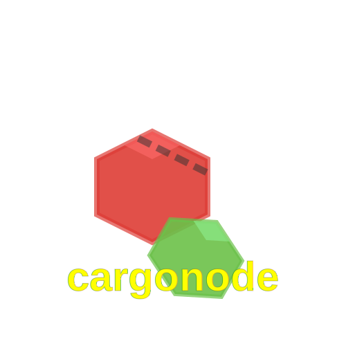

<div align="center">


CLI tool integrating [BiomeJS](https://biomejs.dev), [Tsup](https://tsup.egoist.dev), [Vitest](https://vitest.dev), and [Release-It](https://github.com/release-it/release-it) for Node.js development.

</div>

## Features

- Rust-powered performance
- Tool-agnostic architecture
- Command customization
- Project templates
- Inherited CLI arguments
- Cross-platform support

## Requirements

### System

- Node.js >= 20.11.0
- Rust >= 1.80

### Platforms

- macOS (x64, ARM)
- Linux (x64, ARM)
- Windows (x64, ARM)

## Installation

macOS:

```bash
brew install cargonode
```

Rust:

```bash
cargo install cargonode
```

Additional package managers planned.

## Usage

```bash
# Project
cargonode new my-project
cargonode init

# Operations
cargonode build  # default: tsup
cargonode test   # default: vitest
cargonode fmt    # default: biome
cargonode check  # default: biome
cargonode release # default: release-it

# Help
cargonode --help
cargonode build --help  # displays tsup help
cargonode test run     # runs vitest run
cargonode check --fix  # runs biome check --fix
```

## Configuration

Customize tools via `cargonode.toml`:

```toml
[commands.format]
command = "eslint"  # replace biome
args = ["--fix"]

[commands.release]
prechecks = ["test", "build"]
```

[Template Reference](./templates/node_typescript/cargonode.toml)

### Precedence

1. CLI Arguments
2. Project Configuration
3. Defaults

## Support

[GitHub Issues](https://github.com/xosnrdev/cargonode/issues)

## License

[MIT](./LICENSE-MIT) OR [Apache-2.0](./LICENSE-APACHE)
